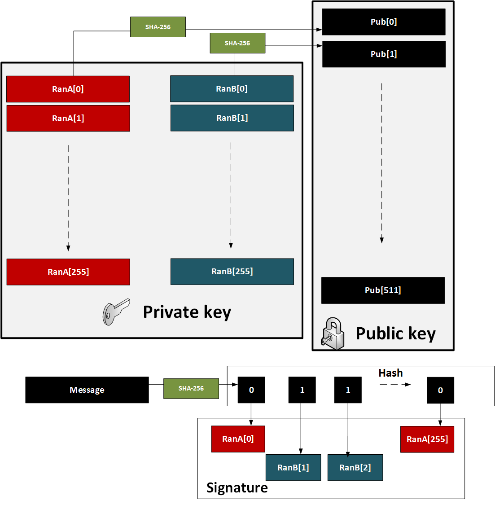

# 1. SPHINCS+ (SLH-DSA) - The Fort Knox of Signatures
Core Idea: Security is based solely on the strength of cryptographic hash functions, which are already very well-trusted and considered quantum-resistant.

## WOTS (Winternitz One-Time Signature) Process
Lamport signature uses 512 random hashes for the private key, and which are split into Set A and Set B. The public key is the hash of each of these values. The size of the private key is 16KB (2×256×256 bits) and the public key size is also 16 KB (512 hashes with each of 256 bits).

Use the Lamport method for one-time signing, but, in its core format, we would need a new public key for each signing. The major problem with Lamport is thus that we can only sign once with each public key. We can overcome this, though, by creating a hash tree which is a merger of many public keys into single root.

```
1. Key Generation:
Create 2 data sets with 256 random 256-bit numbers (Set A and Set B). 

- Create 32 256-bit random numbers (32 values: private key)
- Hash each value 256 times (32 values: public key)

2. Signing:
- Hash message using SHA-256 → 32 8-bit values (N₁, N₂, ..., N₃₂)
- For each 8-bit value (in the hash of the message), hash the private key element (256 - N) times, where N is the value of the 8-bit value).
* test each bit of the hash (0 … 255). If it is a 0, we use the ith number in Set A, else we use the ith number from Set B.
* signature is 256 random numbers (taken from either Set A or Set B) and the public key is the 512 hashes (of Set A and Set B).

3. Verification:
- Hash message with SHA-256 (then take each 8-bit value)
- Hash each 8-bit signature element N times (defined by the message hash value (N1, N2..))
- Result should equal the public key value
```

## Lamport Signature - Simple Explanation
### Key Generation:
```
1. Create 256 pairs of random 256-bit numbers (512 total)

2. Private key: All 512 random numbers

3. Public key: SHA-256 hash of each random number (512 hashes)
```

### Signing:
```
1. Hash message with SHA-256 → 256-bit digest

2. For each bit position (0-255):

If bit = 0 → use number from Set A

If bit = 1 → use number from Set B

3. Signature: 256 selected numbers
```

### Verification:
```
1. Hash message with SHA-256 → same 256-bit digest

2. For each signature element:

- Hash it and compare to corresponding public key

- Must match the public key for that bit value (0=Set A hash, 1=Set B hash)


Example:
Message hash starts with D (hex) = 1101 (binary)

Bit 0 = 1 → Use Set B[0]
Bit 1 = 1 → Use Set B[1]
Bit 2 = 0 → Use Set A[2]
Bit 3 = 1 → Use Set B[3]

The signature reveals only the selected numbers, keeping the others secret.
```

### References
```
[1] Kannwischer, M. J., Rijneveld, J., Schwabe, P., & Stoffelen, K. (2019). pqm4: Testing and Benchmarking NIST PQC on ARM Cortex-M4.
[2] Bernstein, D. J., Hülsing, A., Kölbl, S., Niederhagen, R., Rijneveld, J., & Schwabe, P. (2019, November). The SPHINCS+ signature framework. In Proceedings of the 2019 ACM SIGSAC Conference on Computer and Communications Security (pp. 2129–2146).
[3] Lamport, L. (1979). Constructing digital signatures from a one-way function (Vol. 238). Technical Report CSL-98, SRI International. 
```

Building Blocks: From Simple to Complex
Step 1: The One-Time Signature (OTS) - "Lamport Signature"

```
1. Imagine you want to sign a single bit (0 or 1).

2. Generate 2 random secret numbers: one for '0', one for '1'.

3. Your Public Key is the hash of both secrets.

4. To Sign the bit '0', you reveal the secret for '0'.

5. To Verify, the verifier hashes the revealed secret and checks if it matches the '0' part of the public key.

```

This is scaled up to sign a 256-bit hash by having 256 pairs of secrets. The problem? The keys and signatures are huge, and you can only use it once.



Step 2: The Few-Time Signature - "WOTS+"
```
1. WOTS+ is a smarter OTS that creates much smaller keys and signatures.

2. Private Key: A short list of random numbers.

3. Public Key: The result of hashing each of those private numbers many times.

4. Signing: The message's hash determines how many times to hash each private number. You reveal this partially-hashed result.

5. Verification: The verifier hashes the signature the remaining number of times. If it matches the public key, the signature is valid.
```

Step 3: The Many-Time Signature - "SPHINCS+"
SPHINCS+ solves the "one-time" problem by creating a massive tree of WOTS+ keys.

```
1. You have a single, master key pair.

2. Internally, this master key is the root of a tree containing 1000s of WOTS+ key pairs.

3. Each time you sign a message, you use a different WOTS+ key from this tree.

4. The signature includes:
- The WOTS+ signature from one leaf.
- A path through the tree (a "Merkle path") that proves this leaf key is connected to your master public key.

```

## Step 1: Key Generation (The Setup)
```
We start by creating our private and public keys.

1. Generate Private Key: Create 32 random secret numbers, each 256 bits long.

priv[0], priv[1], ... priv[31]

2. Calculate Public Key: For each of the 32 private keys, hash it exactly 256 times.

pub[0] = Hash(Hash(...Hash(priv[0])...)) // 256 hashes

pub[1] = Hash(Hash(...Hash(priv[1])...)) // 256 hashes

... and so on for all 32.

Your public key is this list of 32 fully-hashed values.

This creates a "starting point" (private key) and a "finish line" (public key) for each of the 32 numbers.
```

## Step 2: Signing a Message (Revealing the Progress)
```
To sign a message, we don't reveal our secrets, but we reveal how close they are to the finish line.

1. Hash the Message: Create a SHA-256 hash of the message you want to sign. This gives you a 256-bit digest.

2. Split into Chunks: Break this 256-bit hash into 32 chunks, each 8 bits (1 byte) long. Each chunk is a number between 0 and 255. Let's call these numbers N[0] to N[31].

3. Create the Signature: For each of the 32 private keys, you hash it not 256 times, but only (256 - N) times.

sig[0] = Hash(Hash(...Hash(priv[0])...)) // (256 - N[0]) hashes

sig[1] = Hash(Hash(...Hash(priv[1])...)) // (256 - N[1]) hashes

...

sig[31] = ... // (256 - N[31]) hashes

The signature is this list of 32 partially-hashed values.

Key Insight: You are publishing a point that is N steps away from the public key finish line.
```

## Step 3: Verifying the Signature (Completing the Race)
```
The verifier uses the signature and the original message to check if everything matches the public key.

1. Hash the Message (Again): The verifier independently calculates the SHA-256 hash of the received message and splits it into the same 32 numbers, N[0] to N[31].

2. Complete the Hashing: For each of the 32 values in the signature, the verifier hashes it the remaining number of times—which is exactly N times.

check[0] = Hash(Hash(...Hash(sig[0])...)) // N[0] hashes

check[1] = Hash(Hash(...Hash(sig[1])...)) // N[1] hashes

...

check[31] = ... // N[31] hashes

3. Compare to Public Key: If the computed check list is identical to the signer's public key, the signature is valid. If even one bit is off, the signature is rejected.
```


This makes SPHINCS+ a stateless scheme—you don't need to remember which keys you've used.

### Why is this Secure?
To forge a signature for a different message, an attacker would need to find values that, when hashed a different number of times, magically land on the same public key. This is computationally infeasible due to the properties of cryptographic hash functions (pre-image resistance).

Revealing a partially-hashed value does not reveal the original private key.


### SPHINCS+ Summary
```
Pros: Extremely secure, based on simple and trusted hash functions.

Cons: Very large signatures.

Analogy: Signing a document by including a unique, notarized fingerprint of every page in a massive, interconnected family tree.
```

| Parameter             | Public Key Size | Private Key Size | Signature Size | Security Level |
|-----------------------|-----------------|------------------|----------------|----------------|
| SPHINCS+-SHA-128s     | 32 bytes        | 64 bytes         | 17,088 bytes   | 128-bit        |
| SPHINCS+-SHA-192s     | 48 bytes        | 96 bytes         | 35,664 bytes   | 192-bit        |
| SPHINCS+-SHA-256s     | 64 bytes        | 128 bytes        | 49,856 bytes   | 256-bit        |


