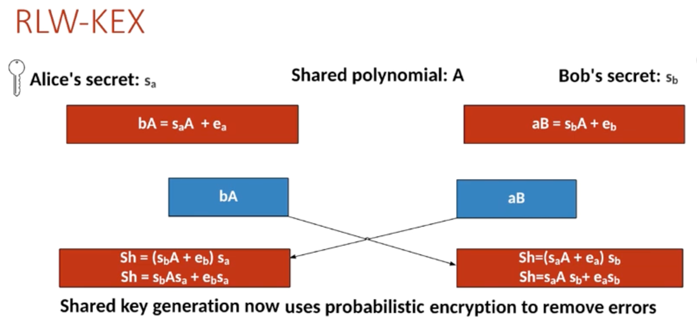
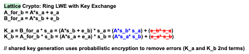

# Learning With Errors (LWE) Encryption
## Overview
Learning With Errors (LWE) is a quantum-resistant cryptographic method developed by Oded Regev in 2005. This implementation demonstrates a simplified version of LWE for educational purposes.

[lattice_based](https://eprint.iacr.org/2015/939.pdf)

LWE (Learning With Errors) and Ring-LWE are considered potential replacements for Diffie-Hellman (DH) in a post-quantum cryptography world. Here's why:

## Why LWE Can Replace DH
1. Quantum Resistance
DH Problem: Based on discrete logarithm problem, which can be efficiently solved by Shor's algorithm on quantum computers

LWE Problem: Believed to be resistant to both classical and quantum attacks

Status: LWE is a leading candidate for NIST's post-quantum cryptography standardization




2. Similar Functionality
Both provide key exchange capabilities:

```
# Diffie-Hellman (Traditional)
Alice: g^a mod p → Bob
Bob: g^b mod p → Alice  
Both compute: g^(ab) mod p

# Ring-LWE (Post-Quantum)
Alice: A, b_A = A×s_A + e_A → Bob
Bob: b_B = A×s_B + e_B → Alice
Both compute: s_A×b_B ≈ s_B×b_A (after error correction)
```

3. Mathematical Foundation
DH: Relies on hardness of discrete log in cyclic groups

LWE: Relies on hardness of solving noisy linear equations

Ring-LWE: More efficient variant using polynomial rings

# LWE vs Diffie-Hellman Comparison

## Comparison Table

| Aspect | Diffie-Hellman | LWE/Ring-LWE |
|--------|----------------|--------------|
| **Security Basis** | Discrete Logarithm | Noisy Linear Algebra |
| **Quantum Safe** | ❌ Broken by Shor's | ✅ Believed safe |
| **Key Sizes** | Small (256-512 bits) | Large (1K-10K bits) |
| **Performance** | Very fast | Slower (matrix ops) |
| **Standardization** | Widely deployed | NIST PQC candidates |

## Key Differences

### Diffie-Hellman
- **Foundation**: Relies on hardness of discrete logarithm problem in cyclic groups
- **Quantum Vulnerability**: Efficiently broken by Shor's algorithm on quantum computers
- **Current Status**: Industry standard for key exchange (TLS, SSH, VPNs)
- **Efficiency**: Small keys, fast computation

### LWE/Ring-LWE  
- **Foundation**: Based on hardness of solving noisy linear equations
- **Quantum Resistance**: Believed to be secure against quantum attacks
- **Current Status**: NIST post-quantum standardization candidate
- **Trade-offs**: Larger keys and slower operations for quantum security

## Transition Timeline
- **Short-term**: DH/ECDH still dominant
- **Medium-term**: Hybrid approaches (DH + LWE)
- **Long-term**: Full transition to post-quantum cryptography like LWE

## Key Generation
```
Secret Key (s): An odd integer known only to the receiver

Error Value (e): A small integer that adds noise to the encryption

Random Values: A set of random integers

Public Key: Generated as public_key[i] = random[i] × s + e
```

## Encryption Process
```
Select a random subset of values from the public key

Calculate the sum of selected values

Add the message (0 or 1) to the sum

Send the encrypted total
```

## Decryption Process
```
Calculate remainder = encrypted_total % secret_key

If remainder is even → message was "0"

If remainder is odd → message was "1"
```

## Security Properties
```
Based on the difficulty of solving t = gs + e when only t and g are known

The error term e provides security through noise

Resistant to quantum computer attacks
```

# Learning With Errors (LWE) and Ring-LWE (RLWE)

Learning With Errors (LWE) and its polynomial version, Ring Learning With Errors (RLWE), form the basis of several post-quantum cryptographic systems. 

---

## 1. Learning With Errors (LWE)

LWE is based on the hardness of solving noisy linear equations.  
We generate:

- a secret vector \( s \)
- a small random error vector \( e \)
- a random public matrix \( A \)

We compute:

$$\
B = A s + e
\$$

Here:

- \( s \) is the **secret key**
- \( A \) and \( B \) form the **public key**

Given \( A \) and \( B \), recovering \( s \) is computationally hard due to the added noise \( e \).


---

## 2. Ring Learning With Errors (RLWE)

RLWE replaces matrices with polynomial rings.  
All operations occur in the ring:

$$\
\mathbb{Z}_q[x]/(x^n + 1)
\$$

where:

- \( n \) is the degree-1 dimension parameter
- \( q = 2^n - 1 \)
- coefficients are reduced modulo \( q \)

---

## 3. Polynomial Setup

### 3.1 Alice chooses:

A public polynomial:

$$\
A(x) = a_{n-1}x^{n-1} + \cdots + a_2 x^2 + a_1 x + a_0
\$$

She reduces it modulo:

$$\
\Phi(x) = x^n + 1
\$$

In Python:

```python
xN_1 = [1] + [0] * (n-1) + [1]   # x^n + 1
A = np.floor(p.polydiv(A, xN_1)[1])
```

### 3.2 Alice generates small random polynomials

Alice samples small error and secret polynomials:

$$\
e_A(x) = e_{n-1}x^{n-1} + \cdots + e_1 x + e_0 \pmod{q}
\$$

$$\
s_A(x) = s_{n-1}x^{n-1} + \cdots + s_1 x + s_0 \pmod{q}
\$$

She then computes:

$$\
b_A(x) = A(x)s_A(x) + e_A(x)
\$$

**Python:**
```python
bA = p.polymul(A, sA) % q
bA = np.floor(p.polydiv(sA, xN_1)[1])
bA = p.polyadd(bA, eA) % q
```

## 4. Bob's Setup

Bob generates his own error and secret polynomials:

$$\
e_B(x), \quad s_B(x)
\$$

Then computes:

$$\
b_B(x) = A(x)s_B(x) + e_B(x)
\$$

```
sB = gen_poly(n, q)
eB = gen_poly(n, q)

bB = p.polymul(A, sB) % q
bB = np.floor(p.polydiv(sB, xN_1)[1])
bB = p.polyadd(bB, eB) % q

```

Alice sends \( A(x) \) to Bob; Bob sends \( b_B(x) \) to Alice.


---

## 5. Shared Secret Computation

Alice computes:

$$\
\text{shared}_A
= \left( b_B(x) \cdot s_A(x) \right) \bmod (x^n + 1)
\$$

Bob computes:

$$\
\text{shared}_B
= \left( b_A(x) \cdot s_B(x) \right) \bmod (x^n + 1)
\$$


```
sharedAlice = np.floor(p.polymul(sA, bB) % q)
sharedAlice = np.floor(p.polydiv(sharedAlice, xN_1)[1]) % q

sharedBob = np.floor(p.polymul(sB, bA) % q)
sharedBob = np.floor(p.polydiv(sharedBob, xN_1)[1]) % q

```

At the end:

$$\
\text{shared}_A = \text{shared}_B
\$$

Thus, Alice and Bob derive a common shared key.

---

## Summary

- **LWE** uses linear algebra with noise.  
- **RLWE** uses polynomial arithmetic modulo \( x^n + 1 \).  
- Both produce a shared secret via a Diffie–Hellman–like exchange.  
- Noise polynomials make inversion hard, ensuring post-quantum security.

Refer: [url](https://summerschool-croatia.cs.ru.nl/2018/slides/Introduction%20to%20post-quantum%20cryptography%20and%20learning%20with%20errors.pdf)


# Ring Learning With Errors Key Exchange (RLWE-KEX)

RLWE is a quantum-resistant key-exchange method based on **Learning With Errors (LWE)** but performed over the polynomial ring:

$$\
\mathbb{Z}_q[x] / (x^n + 1)
\$$

Alice and Bob agree on parameters:

- Polynomial degree: \(n\)  
- Modulus: \(q = 2^n + 1\)  
- Ring: R_q = 

$$\
\mathbb{Z}_q[x]/(x^n+1)
\$$


They then generate secret and error polynomials from small distributions.

---

## 1. Setup

They agree on:

- \(n\): highest polynomial degree  
- \(q = 2^n + 1\): coefficient modulus  
- Public polynomial \(A(x)\in R_q\)

Division by \(x^n + 1\) ensures the ring structure:

$$\
A(x) \bmod (x^n + 1)
\$$

In code:

```python
xN_1 = [1] + [0]*(n-1) + [1]  # x^n + 1
A = np.floor(p.polydiv(A, xN_1)[1])
```

## 2. Alice Generates Secrets

Alice samples two polynomials from a small-error distribution:

- **Secret polynomial**

$$\
  s_A(x) = \sum_{i=0}^{n-1} s_i x^i
\$$

- **Error polynomial**

$$\
  e_A(x) = \sum_{i=0}^{n-1} e_i x^i
\$$

She computes:

$$\
b_A(x) = A(x)\cdot s_A(x) + e_A(x) \pmod q
\$$

**Code:**
```python
bA = p.polymul(A, sA) % q
bA = np.floor(p.polydiv(bA, xN_1)[1])  # mod (x^n + 1)
bA = p.polyadd(bA, eA) % q
```

## 3. Bob Generates His Secrets

Bob samples:

- Secret polynomial:

$$\
  s_B(x) = \sum_{i=0}^{n-1} s'_i x^i
\$$

- Error polynomial:

$$\
  e_B(x) = \sum_{i=0}^{n-1} e'_i x^i
\$$

He computes:

$$\
b_B(x) = A(x)\cdot s_B(x) + e_B(x)
\$$

**Code:**
```python
bB = p.polymul(A, sB) % q
bB = np.floor(p.polydiv(bB, xN_1)[1])   # mod (x^n + 1)
bB = p.polyadd(bB, eB) % q
```

5. Noise Extraction → Final Bitstring

Map each coefficient \(x_i\) of the shared polynomial to one bit using thresholding:

If $$\ x_i < \frac{q}{4} \$$ → 0  
Else if $$\ x_i < \frac{q}{2} \$$ → 1  
Else if $$\ x_i < \frac{3q}{4} \$$ → 0  
Else → 1

This deterministic rounding removes the small RLWE noise and yields matching bitstrings for Alice and Bob.

---

6. Security Parameters

Security | \(n\) | \(q\) | \(\Phi(x)\)
---------|------|-------|--------------
128-bit  | 512  | 25,601 | \(x^{512} + 1\)
256-bit  | 1,024 | 40,961 | \(x^{1024} + 1\)

These parameter choices reflect RLWE hardness assumptions considered quantum-resistant.

---

7. Example Output (n = 10, \(q = 2^{10} + 1 = 1023\))
```
Before extraction (example shared polynomials):

Alice: [1010. 1021. 1011. 1019.    0. 1012. 1017. 1015.    9.    3.]  
Bob:   [1008. 1022. 1014. 1017. 1016. 1018.    1. 1019.    2.   12.]

After noise extraction → bitstring:

Alice: [1 0 0 1 0 1 1 1 1 0]  
Bob:   [1 0 0 1 0 1 1 1 1 0]

Both parties derive the same secret key bitstring.
```

# NTRU Encryption: Lattice Encryption (NTRU - Nth degree TRUncated polynomial ring)

NTRU is a quantum-resistant encryption method that's faster than RSA and based on lattice mathematics. Think of it as using polynomial equations instead of large prime numbers.

With Lattice encryption, Bob and Alice agree to share N, p and q, and then Bob generates two short polynomials (f and g), and generates his key pair from this. Alice receives this, and she generates a random polynomial, and encrypts some data for Bob. Bob then decrypts the message with his private key. We generate the public and private key from N, p and q.

```
N: prime
p: prime
q (where gcd(p,q) = 1)
```


1. Setup Phase
```
N=7 - Size of polynomials (like password length)

p=29, q=491531 - Mathematical parameters that work together

Everyone agrees on these numbers upfront
```

2. Bob Creates Keys
```
Bob picks two secret polynomials:
f(x) = [1, 1, -1, 0, -1, 1]     (Private Key)
g(x) = [-1, 0, 1, 1, 0, 0, -1]  (Used to make Public Key)

Bob's Public Key: [394609, 27692, 62307, ...]  (Anyone can see this)
```

3. Alice Encrypts

```
Alice's Message: [1, 0, 1, 0, 1, 1, 1]  (Binary data)
Alice's Random:  [-1, -1, 1, 1]         (Temporary secret)

Encrypted: [283889, 269991, 484569, ...]  (Scrambled message)
```

4. Bob Decrypts

```
Bob uses his Private Key (f) to unscramble:
Encrypted: [283889, 269991, 484569, ...] 
→ Decrypted: [1, 0, 1, 0, 1, 1, 1]  (Original message!)
```

## Why It's Secure
Quantum Computers can't break it (unlike RSA)

Fast - 2-3x faster than RSA

Based on lattice problems - Hard math that's resistant to attacks

## Real-World Security Levels
Moderate: N=167 (like 512-bit RSA)

Standard: N=251 (like 1024-bit RSA)

High: N=503 (like 2048-bit RSA)

## Simple Analogy
Think of NTRU like a special mathematical blender:

Public Key = Blender settings everyone can see

Private Key = Secret un-blender recipe only Bob knows

Encryption = Alice puts her message in the blender

Decryption = Bob uses his recipe to un-blend the message

It's secure because even if you see the blended result and know the blender settings, you can't figure out how to un-blend it without Bob's secret recipe!

The polynomials act like the mathematical "blending" operations that make this work securely.

```
NTRU Encryption Step-by-Step 
🔑 Step 1: Setup Parameters
Everyone agrees on these public values:

N = 7 (Size of polynomials)

p = 29 (Small modulus for messages)

q = 491531 (Large modulus for encryption)

👨‍💻 Step 2: Bob Generates Keys
Private Key Creation:
1. Bob picks 2 secret polynomials:

f = [1, 1, -1, 0, -1, 1] (his main private key)

g = [-1, 0, 1, 1, 0, 0, -1] (helper polynomial)

2. Bob computes inverses:

Finds f⁻¹ mod p and f⁻¹ mod q (mathematical inverses)

3. Bob creates public key:

Public Key = f⁻¹ × g mod q

Result: [394609, 27692, 62307, 263073, 346149, 41538, 339225]

Bob now has:

✅ Private: f, g, f⁻¹ mod p

✅ Public: h = f⁻¹ × g mod q

👩‍💻 Step 3: Alice Encrypts Message
Encryption Process:
1. Alice gets Bob's public key

2. Alice prepares her message:

Message: [1, 0, 1, 0, 1, 1, 1] (binary data as polynomial)

3. Alice picks a random polynomial:

Random: [-1, -1, 1, 1]

4. Alice computes encrypted message:

Encrypted = p × random × public_key + message mod q

Result: [283889, 269991, 484569, 353054, 179995, 159222, 235409]

🔓 Step 4: Bob Decrypts
Decryption Process:
1. Bob receives encrypted message

2. Step 1: Multiply by private key f:

a = f × encrypted mod q

This removes the public key component

3. Step 2: Center lift:

Adjust coefficients to be centered around zero

4. Step 3: Multiply by f⁻¹ mod p:

message = f⁻¹ × a mod p

This cleans up the result

5. Final output: [1, 0, 1, 0, 1, 1, 1] ✅

🎯 Why This Works
The Magic Formula:
text
Encryption: e = p·r·h + m mod q
Decryption: f⁻¹ × (f × e) mod p = f⁻¹ × (f × (p·r·h + m)) mod p
Since h = f⁻¹ × g, substituting gives:

```text
f × e = f × (p·r·f⁻¹·g + m) mod q
      = p·r·g + f·m mod q
```

```
After center lifting and multiplying by f⁻¹ mod p:
```

```text
f⁻¹ × (p·r·g + f·m) mod p = f⁻¹ × f·m mod p = m
```

```
The p·r·g term disappears because it's multiplied by p and we're working mod p.

🛡️ Security Properties
Quantum Resistant: Based on lattice problems, not factoring

Fast: Much faster than RSA

Small Keys: Compared to other post-quantum systems

Ternary Polynomials: Only -1, 0, 1 coefficients make computations efficient

📊 Real-World Security Levels
N=167 → Moderate security (like 512-bit RSA)

N=251 → Standard security (like 1024-bit RSA)

N=503 → High security (like 2048-bit RSA)
```