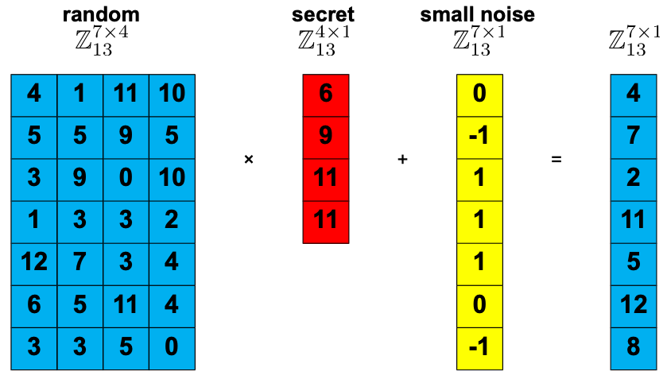

# Learning With Errors (LWE) Encryption
## Overview
Learning With Errors (LWE) is a quantum-resistant cryptographic method developed by Oded Regev in 2005. This implementation demonstrates a simplified version of LWE for educational purposes.

## Key Generation
```
Secret Key (s): An odd integer known only to the receiver

Error Value (e): A small integer that adds noise to the encryption

Random Values: A set of random integers

Public Key: Generated as public_key[i] = random[i] × s + e
```

## Encryption Process
```
Select a random subset of values from the public key

Calculate the sum of selected values

Add the message (0 or 1) to the sum

Send the encrypted total
```

## Decryption Process
```
Calculate remainder = encrypted_total % secret_key

If remainder is even → message was "0"

If remainder is odd → message was "1"
```

## Security Properties
```
Based on the difficulty of solving t = gs + e when only t and g are known

The error term e provides security through noise

Resistant to quantum computer attacks
```

# Learning With Errors (LWE) and Ring-LWE (RLWE)

Learning With Errors (LWE) and its polynomial version, Ring Learning With Errors (RLWE), form the basis of several post-quantum cryptographic systems. 

---

## 1. Learning With Errors (LWE)

LWE is based on the hardness of solving noisy linear equations.  
We generate:

- a secret vector \( s \)
- a small random error vector \( e \)
- a random public matrix \( A \)

We compute:

$$\
B = A s + e
\$$

Here:

- \( s \) is the **secret key**
- \( A \) and \( B \) form the **public key**

Given \( A \) and \( B \), recovering \( s \) is computationally hard due to the added noise \( e \).



---

## 2. Ring Learning With Errors (RLWE)

RLWE replaces matrices with polynomial rings.  
All operations occur in the ring:

$$\
\mathbb{Z}_q[x]/(x^n + 1)
\$$

where:

- \( n \) is the degree-1 dimension parameter
- \( q = 2^n - 1 \)
- coefficients are reduced modulo \( q \)

---

## 3. Polynomial Setup

### 3.1 Alice chooses:

A public polynomial:

$$\
A(x) = a_{n-1}x^{n-1} + \cdots + a_2 x^2 + a_1 x + a_0
\$$

She reduces it modulo:

$$\
\Phi(x) = x^n + 1
\$$

In Python:

```python
xN_1 = [1] + [0] * (n-1) + [1]   # x^n + 1
A = np.floor(p.polydiv(A, xN_1)[1])
```

### 3.2 Alice generates small random polynomials

Alice samples small error and secret polynomials:

$$\
e_A(x) = e_{n-1}x^{n-1} + \cdots + e_1 x + e_0 \pmod{q}
\$$

$$\
s_A(x) = s_{n-1}x^{n-1} + \cdots + s_1 x + s_0 \pmod{q}
\$$

She then computes:

$$\
b_A(x) = A(x)s_A(x) + e_A(x)
\$$

**Python:**
```python
bA = p.polymul(A, sA) % q
bA = np.floor(p.polydiv(sA, xN_1)[1])
bA = p.polyadd(bA, eA) % q
```

## 4. Bob's Setup

Bob generates his own error and secret polynomials:

$$\
e_B(x), \quad s_B(x)
\$$

Then computes:

$$\
b_B(x) = A(x)s_B(x) + e_B(x)
\$$

```
sB = gen_poly(n, q)
eB = gen_poly(n, q)

bB = p.polymul(A, sB) % q
bB = np.floor(p.polydiv(sB, xN_1)[1])
bB = p.polyadd(bB, eB) % q

```

Alice sends \( A(x) \) to Bob; Bob sends \( b_B(x) \) to Alice.


---

## 5. Shared Secret Computation

Alice computes:

$$\
\text{shared}_A
= \left( b_B(x) \cdot s_A(x) \right) \bmod (x^n + 1)
\$$

Bob computes:

$$\
\text{shared}_B
= \left( b_A(x) \cdot s_B(x) \right) \bmod (x^n + 1)
\$$


```
sharedAlice = np.floor(p.polymul(sA, bB) % q)
sharedAlice = np.floor(p.polydiv(sharedAlice, xN_1)[1]) % q

sharedBob = np.floor(p.polymul(sB, bA) % q)
sharedBob = np.floor(p.polydiv(sharedBob, xN_1)[1]) % q

```

At the end:

$$\
\text{shared}_A = \text{shared}_B
\$$

Thus, Alice and Bob derive a common shared key.

---

## Summary

- **LWE** uses linear algebra with noise.  
- **RLWE** uses polynomial arithmetic modulo \( x^n + 1 \).  
- Both produce a shared secret via a Diffie–Hellman–like exchange.  
- Noise polynomials make inversion hard, ensuring post-quantum security.

Refer: [url](https://summerschool-croatia.cs.ru.nl/2018/slides/Introduction%20to%20post-quantum%20cryptography%20and%20learning%20with%20errors.pdf)


# Ring Learning With Errors Key Exchange (RLWE-KEX)

RLWE is a quantum-resistant key-exchange method based on **Learning With Errors (LWE)** but performed over the polynomial ring:

$$\
\mathbb{Z}_q[x] / (x^n + 1)
\$$

Alice and Bob agree on parameters:

- Polynomial degree: \(n\)  
- Modulus: \(q = 2^n + 1\)  
- Ring: R_q = 

$$\
\mathbb{Z}_q[x]/(x^n+1)
\$$


They then generate secret and error polynomials from small distributions.

---

## 1. Setup

They agree on:

- \(n\): highest polynomial degree  
- \(q = 2^n + 1\): coefficient modulus  
- Public polynomial \(A(x)\in R_q\)

Division by \(x^n + 1\) ensures the ring structure:

$$\
A(x) \bmod (x^n + 1)
\$$

In code:

```python
xN_1 = [1] + [0]*(n-1) + [1]  # x^n + 1
A = np.floor(p.polydiv(A, xN_1)[1])
```

## 2. Alice Generates Secrets

Alice samples two polynomials from a small-error distribution:

- **Secret polynomial**
  $$\
  s_A(x) = \sum_{i=0}^{n-1} s_i x^i
  \$$

- **Error polynomial**
  $$\
  e_A(x) = \sum_{i=0}^{n-1} e_i x^i
  \$$

She computes:
$$\
b_A(x) = A(x)\cdot s_A(x) + e_A(x) \pmod q
\$$

**Code:**
```python
bA = p.polymul(A, sA) % q
bA = np.floor(p.polydiv(bA, xN_1)[1])  # mod (x^n + 1)
bA = p.polyadd(bA, eA) % q
```

## 3. Bob Generates His Secrets

Bob samples:

- Secret polynomial:
  $$\
  s_B(x) = \sum_{i=0}^{n-1} s'_i x^i
  \$$

- Error polynomial:
  $$\
  e_B(x) = \sum_{i=0}^{n-1} e'_i x^i
  \$$

He computes:
$$\
b_B(x) = A(x)\cdot s_B(x) + e_B(x)
\$$

**Code:**
```python
bB = p.polymul(A, sB) % q
bB = np.floor(p.polydiv(bB, xN_1)[1])   # mod (x^n + 1)
bB = p.polyadd(bB, eB) % q
```

5. Noise Extraction → Final Bitstring

Map each coefficient \(x_i\) of the shared polynomial to one bit using thresholding:

If \(x_i < \frac{q}{4}\) → 0  
Else if \(x_i < \frac{q}{2}\) → 1  
Else if \(x_i < \frac{3q}{4}\) → 0  
Else → 1

This deterministic rounding removes the small RLWE noise and yields matching bitstrings for Alice and Bob.

---

6. Security Parameters

Security | \(n\) | \(q\) | \(\Phi(x)\)
---------|------|-------|--------------
128-bit  | 512  | 25,601 | \(x^{512} + 1\)
256-bit  | 1,024 | 40,961 | \(x^{1024} + 1\)

These parameter choices reflect RLWE hardness assumptions considered quantum-resistant.

---

7. Example Output (n = 10, \(q = 2^{10} + 1 = 1023\))
```
Before extraction (example shared polynomials):

Alice: [1010. 1021. 1011. 1019.    0. 1012. 1017. 1015.    9.    3.]  
Bob:   [1008. 1022. 1014. 1017. 1016. 1018.    1. 1019.    2.   12.]

After noise extraction → bitstring:

Alice: [1 0 0 1 0 1 1 1 1 0]  
Bob:   [1 0 0 1 0 1 1 1 1 0]

Both parties derive the same secret key bitstring.
```


