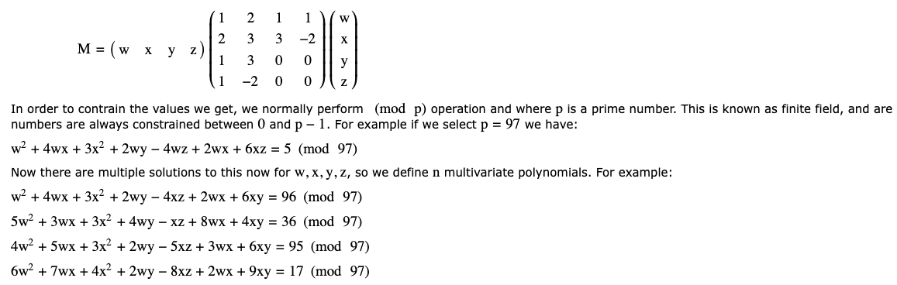

# Multivariate Cryptography - Multivariate Quadratic (MQ)

## What is Multivariate Cryptography?

Multivariate cryptography uses systems of polynomial equations with multiple variables. It's considered **quantum-resistant** because solving these equations is hard even for quantum computers.

## Simple Example

Imagine we have 4 variables (w, x, y, z) and polynomial equations like:

```
w² + 4wx + 3x² + 2wy - 4wz + 2wz + 6xy = 96 (mod 97)
```

We know the solution is: **w=7, x=4, y=5, z=6**



## How It Works

### Matrix Representation
Each polynomial can be represented as a matrix operation:

```
Result = m × M × mᵀ (mod p)
```


Where:
- **m** = variable vector [w, x, y, z]
- **M** = coefficient matrix
- **p** = prime modulus (97 in our example)

### The Hard Problem
Given the equations and results, **finding the original variables is extremely difficult** - this is the security foundation.

## Real-World Applications

- **Rainbow**: NIST post-quantum signature finalist
- **Oil-and-Vinegar**: Early multivariate scheme
- **Unbalanced Oil and Vinegar**: Enhanced version

## Why It's Quantum-Resistant

Quantum computers are good at solving certain math problems (like factoring), but **solving multivariate polynomial systems remains hard** for both classical and quantum computers.

[Reference](https://www.di.ens.fr/brice.minaud/slides/Qhub-2018.pdf)
