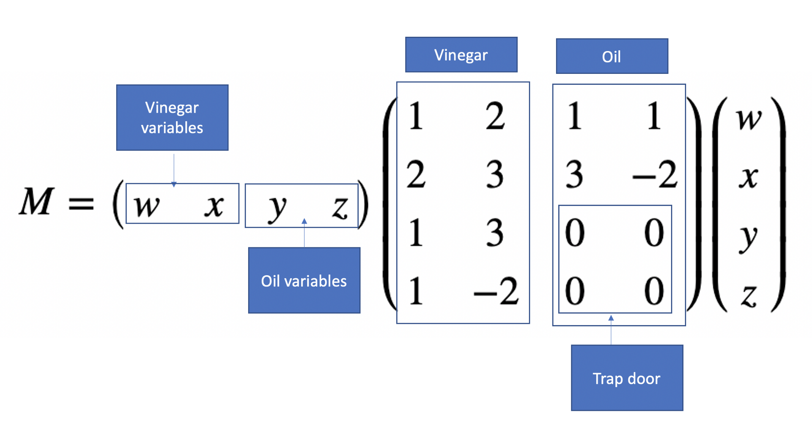
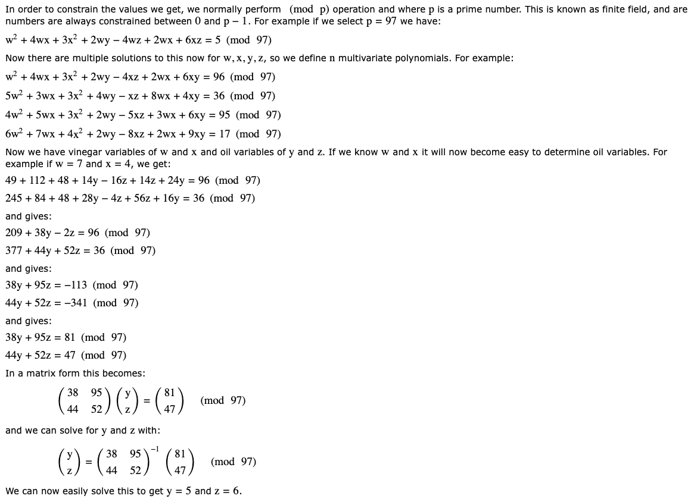

# Multivariate Cryptography - Multivariate Quadratic (MQ)

## What is Multivariate Cryptography?

Multivariate cryptography uses systems of polynomial equations with multiple variables. It's considered **quantum-resistant** because solving these equations is hard even for quantum computers.

## Simple Example

Imagine we have 4 variables (w, x, y, z) and polynomial equations like:

```
w² + 4wx + 3x² + 2wy - 4wz + 2wz + 6xy = 96 (mod 97)
```

We know the solution is: **w=7, x=4, y=5, z=6**


## How It Works

### Matrix Representation
Each polynomial can be represented as a matrix operation:

```
Result = m × M × mᵀ (mod p)
```


Where:
- **m** = variable vector [w, x, y, z]
- **M** = coefficient matrix
- **p** = prime modulus (97 in our example)

### The Hard Problem
Given the equations and results, **finding the original variables is extremely difficult** - this is the security foundation.

## Real-World Applications

- **Rainbow**: NIST post-quantum signature finalist
- **Oil-and-Vinegar**: Early multivariate scheme
- **Unbalanced Oil and Vinegar**: Enhanced version

## Why It's Quantum-Resistant

Quantum computers are good at solving certain math problems (like factoring), but **solving multivariate polynomial systems remains hard** for both classical and quantum computers.

[Reference](https://www.di.ens.fr/brice.minaud/slides/Qhub-2018.pdf)


# Oil and Vinegar Cryptography

## The Core Idea: A Mathematical Trapdoor

**Problem**: Multivariate cryptography is normally hard to solve, but we want to make it **easy if you know a secret**.

**Solution**: Use a "trapdoor" by separating variables into two types:

### 🔐 Variable Types
- **Vinegar Variables**: Secret values (only known to the creator)
- **Oil Variables**: Values to be discovered (can be solved if vinegar is known)

### 🎯 The Trapdoor Design
The magic happens in the coefficient matrix where **oil variables never mix with each other** - their intersections are zeros. This creates a solvable system when vinegar values are known.

## Example Walkthrough

### Original Hard Problem
4 complex polynomial equations:

```
w² + 4wx + 3x² + 2wy - 4xz + 2wz + 6xy = 96 (mod 97)

5w² + 3wx + 3x² + 4wy - xz + 8wz + 4xy = 36 (mod 97)

4w² + 5wx + 3x² + 2wy - 5xz + 3wz + 6xy = 95 (mod 97)

6w² + 7wx + 4x² + 2wy - 8xz + 2wz + 9xy = 17 (mod 97)
```


**Without the secret**, this is extremely hard to solve!

### 🗝️ Using the Secret (Trapdoor)
We know the **vinegar variables**: `w = 7`, `x = 4`

Substitute these into the equations:

**Equation 1:**
```
7² + 4×7×4 + 3×4² + 2×7×y - 4×4×z + 2×7×z + 6×7×4 = 96 (mod 97)
49 + 112 + 48 + 14y - 16z + 14z + 168 = 96
```

Simplify:
```
377 + 14y - 2z = 96 (mod 97)
14y - 2z = -281 (mod 97)
14y - 2z = 10 (mod 97) [since -281 ≡ 10 mod 97]
```


**Equation 2:**
```
5×7² + 3×7×4 + 3×4² + 4×7×y - 4×z + 8×7×z + 4×7×4 = 36 (mod 97)
245 + 84 + 48 + 28y - 4z + 56z + 112 = 36
```

Simplify:
```
589 + 28y + 52z = 36 (mod 97)
28y + 52z = -553 (mod 97)
28y + 52z = 34 (mod 97) [since -553 ≡ 34 mod 97]
```


### 📊 Reduced to Simple Linear System
Now we have:
```
14y - 2z = 10 (mod 97)
28y + 52z = 34 (mod 97)
```


In matrix form:
```
[14 -2] [y] [10]
[28 52] [z] = [34]
```


### 🧮 Easy to Solve!
This is now a simple **2×2 linear system** that can be easily solved to find:
- **y = 5**
- **z = 6**

## Why This Works

### 🔄 The Transformation
- **Hard Problem**: Solving n multivariate polynomial equations
- **Easy Problem**: Solving n linear equations (when vinegar is known)

### 🛡️ Security Properties
- **Without vinegar**: Exponentially hard to solve
- **With vinegar**: Polynomial time to solve  
- **Quantum-resistant**: Based on hard multivariate problems

## Real-World Usage
- **Unbalanced Oil and Vinegar (UOV)**: Popular signature scheme
- **Rainbow**: NIST post-quantum finalist (builds on UOV)
- **Digital Signatures**: Create signatures easy with secret, hard to forge without

The oil and vinegar separation creates the perfect trapdoor: **easy for the key owner, hard for everyone else**.




