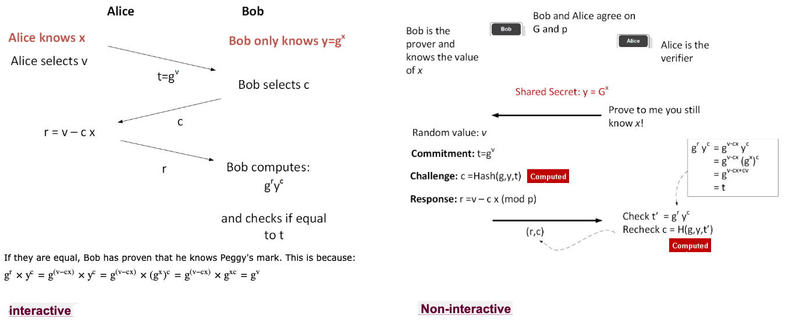

# Schnorr-Fiat-Shamir 

## Core Concept
The method for creating the lattice-based signatures is actually based on the Schnorr signature method for proof of identity (a Zero Knowledge Proof) and then applies the Fiat-Shamir method to make it non-interactive. It’s a NI-ZKP (Non-interactive Zero Knowledge Proof) of a secret (a person’s private key).

**No trapdoors needed!** Modern lattice-based signatures (like ML-DSA) use **Zero Knowledge Proofs** to prove you know a secret without revealing it.

## How It Works - The Interactive Version

### Setup
- **Private Key**: A secret vector `x`
- **Public Key**: `u = A·x` (where `A` is a public matrix)

### The "Proof of Identity" Dance
1. **Bob's Commitment**: 
   - Creates random vector `y`
   - Sends `v = A·y` to Alice

2. **Alice's Challenge**:
   - Sends random number `c` to Bob

3. **Bob's Response**:
   - Computes `z = c·x + y`
   - Sends `z` to Alice

4. **Alice Verifies**:
   - Checks if `A·z = c·u + v`
   - If equal → Bob proves he knows `x` without revealing it!

## Making It Non-Interactive (Fiat-Shamir)

Instead of waiting for Alice's challenge:
- **Bob generates his own challenge**: `c = H(v || Message)`
- **Signature** = `(v, z)`

### Verification
Anyone can:
1. Recompute `c = H(v || Message)`
2. Check `A·z = c·u + v`

## Why This Matters
- **Quantum-resistant**: Based on hard lattice problems
- **Efficient**: Small signatures, fast verification
- **Secure**: Proves knowledge without revealing the secret

**Bottom line**: You prove you know a secret by answering a challenge that only someone with the secret could answer correctly.


# Interactive vs Non-Interactive Zero-Knowledge Proofs

## Interactive Proof (The "Conversation")
**Like a teacher-student dialogue:**
1. **Commitment**: Prover sends `t = g^v mod P` (hides secret `x`)
2. **Challenge**: Verifier sends random `c` 
3. **Response**: Prover sends `r = v - c·x`
4. **Verification**: Check if `t = g^r · y^c mod P`

**Requires back-and-forth interaction between prover and verifier.**

## Non-Interactive Proof (The "Self-Solved Puzzle")  
**Like submitting a completed exam:**
1. **Setup**: Same secret `x`, public `y = g^x`
2. **Commitment**: Prover computes `t = g^v`
3. **Self-Challenge**: Prover calculates `c = Hash(g + y + t)` (creates own challenge)
4. **Self-Response**: Prover computes `r = v - c·x`
5. **Proof**: Sends `[t, r]` as complete proof

**Verifier can independently:**
- Recompute `c = Hash(g + y + t)`
- Verify `t = g^r · y^c`

## Key Difference
- **Interactive**: Requires live challenge-response (like an oral exam)
- **Non-Interactive**: Prover generates everything at once (like a written exam)
- **Fiat-Shamir**: Converts interactive → non-interactive using cryptographic hash as "virtual verifier"

# Interactive vs Non-Interactive Zero-Knowledge Proofs

## Interactive Proof (The "Conversation")
**Like a teacher-student dialogue:**
1. **Commitment**: Prover sends `t = g^v mod P` (hides secret `x`)
2. **Challenge**: Verifier sends random `c` 
3. **Response**: Prover sends `r = v - c·x`
4. **Verification**: Check if `t = g^r · y^c mod P`

**Requires back-and-forth interaction between prover and verifier.**

## Non-Interactive Proof (The "Self-Solved Puzzle")  
**Like submitting a completed exam:**
1. **Setup**: Same secret `x`, public `y = g^x`
2. **Commitment**: Prover computes `t = g^v`
3. **Self-Challenge**: Prover calculates `c = Hash(g + y + t)` (creates own challenge)
4. **Self-Response**: Prover computes `r = v - c·x`
5. **Proof**: Sends `[t, r]` as complete proof

**Verifier can independently:**
- Recompute `c = Hash(g + y + t)`
- Verify `t = g^r · y^c`

## Key Difference
- **Interactive**: Requires live challenge-response (like an oral exam)
- **Non-Interactive**: Prover generates everything at once (like a written exam)
- **Fiat-Shamir**: Converts interactive → non-interactive using cryptographic hash as "virtual verifier"



# Relating Schnorr Proofs to Lattice Signatures (ML-DSA)

## The Same Pattern, Different Math

### Schnorr Proof (Discrete Log)
**Setup**: `y = g^x mod n`  
- **Secret**: `x` (private key)
- **Public**: `y` (public key)

**Interactive Proof**:
1. **Commit**: `t = g^v`
2. **Challenge**: Verifier sends `c`
3. **Response**: `r = v - c·x`
4. **Verify**: `g^r · y^c == t`

**Non-Interactive** (Fiat-Shamir):
- `c = Hash(g, y, t, message)`
- Proof = `(t, r)`

### Lattice Proof (ML-DSA - Lattice-based)
**Setup**: `u = A·x + e`  
- **Secret**: Vector `x` (private key)
- **Public**: Vector `u` (public key)
- `A` = public matrix, `e` = small error

**Interactive Proof**:
1. **Commit**: `v = A·y + e2`
2. **Challenge**: Verifier sends `c`
3. **Response**: `z = c·x + y`
4. **Verify**: `A·z == c·u + v`

**Non-Interactive** (Fiat-Shamir):
- `c = Hash(A, u, v, message)`
- Proof = `(v, z)`

## Direct Comparison

| Step | Schnorr (Your Code) | Lattice (ML-DSA) |
|------|---------------------|------------------|
| **Setup** | `y = g^x` | `u = A·x + e` |
| **Commit** | `t = g^v` | `v = A·y + e2` |
| **Challenge** | Random `c` | Random `c` |
| **Response** | `r = v - c·x` | `z = c·x + y` |
| **Verify** | `g^r · y^c == t` | `A·z == c·u + v` |


## Lattice Version (ML-DSA Concept)
```
Setup: u = A·x + e (public key)

Sign:
- v = A·y + e2 (commitment)
- c = Hash(v, message) (Fiat-Shamir challenge)
- z = c·x + y (response)

Verify: Check A·z == c·u + v
```

## Traditional Version 
```
Setup: y = g^x mod p (public key)

Sign:
- t = g^v mod p (commitment)
- c = Hash(g, t, message) (Fiat-Shamir challenge)
- r = v - c·x (response)

Verify: Check g^r · y^c == t
```

## Same Cryptographic Pattern
Both methods use identical Fiat-Shamir structure, proving that ML-DSA builds on the same proven zero-knowledge proof principles as traditional signatures, just with quantum-resistant lattice math instead of discrete logarithms.


## Why This Matters for ML-DSA

**No Trapdoors Needed!** Unlike RSA that needs mathematical "backdoors," both methods:
1. Prove knowledge of a secret without revealing it
2. Use the same Fiat-Shamir transformation
3. Create secure digital signatures from identification protocols

**Your code demonstrates the exact same cryptographic pattern used in post-quantum ML-DSA signatures**, just with different underlying mathematics (discrete log vs. lattice problems).

## The Big Picture

Both methods follow the same blueprint:
1. **Commit** to randomness
2. **Challenge** with random value (or hash for non-interactive)
3. **Respond** using the secret
4. **Verify** the proof

This pattern is why lattice-based signatures are considered the modern replacement for traditional methods - they use the same proven ZKP structure but with quantum-resistant math.

# Lattice Signatures Made Simple

## The Big Idea
**No trapdoors needed!** We prove knowledge of a secret using zero-knowledge proofs instead of mathematical backdoors.

## How It Works - The Magic Math

### Setup
- **Secret**: Vector `x` (private key)
- **Public**: Matrix `A` + Public key `u = A·x`

### The 3-Step Proof

1. **Commit** → Bob: "I'll use random vector `y` and send `v = A·y`"
2. **Challenge** → Alice: "Prove it! Use this random number `c`"
3. **Respond** → Bob: "Here's `z = c·x + y`"

### Verification
Alice checks: **`A·z = c·u + v`**

## Why This Works
```
A·z = A·(c·x + y) = A·c·x + A·y
c·u + v = c·A·x + A·y
```
**Both sides equal A·c·x + A·y!** Only someone who knows `x` can make this work.

## Making It Non-Interactive (Fiat-Shamir)
Instead of Alice sending `c`, Bob calculates:
**`c = Hash(v || Message)`**

Now Bob can create a signature `(v, z)` that anyone can verify by:
1. Computing `c = Hash(v || Message)`
2. Checking `A·z = c·u + v`

## Key Insight
The same person who created `v = A·y` must also be the one who knows `x` to compute `z = c·x + y` correctly. The hash function acts as an "unpredictable verifier" that ensures the proof is tied to the specific message.


